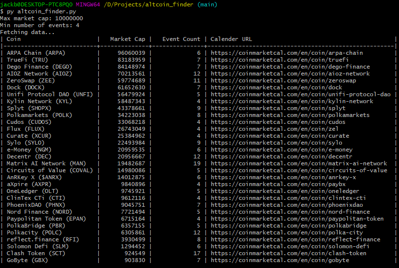

# Altcoin Finder
Scrapes coin market cal for viable altcoins. It just looks for ones with a low market cap and a number of events coming up beyond that so you'll have to do the requisite fundamental analysis to actually determine what's potentially profitable and what is snake oil.

## Install
Not much to install assuming you already have python3. It has a few dependencies so if you don't already have them installed:
```
pip install bs4
pip install tabulate
```
I think the other dependencies ship with python.

## To run it
```
py altcoin_finder.py
```
This will generate a list of all coins with a market cap of less than $100,000,000 and at least 3 events coming up. You can specify a max market cap with **--market-cap=<YOUR MAX MARKET CAP>** or **-m <YOUR MAX MARKET CAP>** and you can specify a min number of events with **--num-events=<YOUR MIN NUMBER OF EVENTS>** or **-e <YOUR MIN NUMBER OF EVENTS>**.
Ex:
```
py altcoin_finder.py --market-cap=5000000 --num-events=4
```
or
```
py altcoin_finder.py -m 5000000 -e 4
```
The parsing of the data happens pretty quickly but it can take a little while to fetch the data. It takes about ~15 seconds to run on my connection (45 mbps at the time of this writing). Output should look like this:
